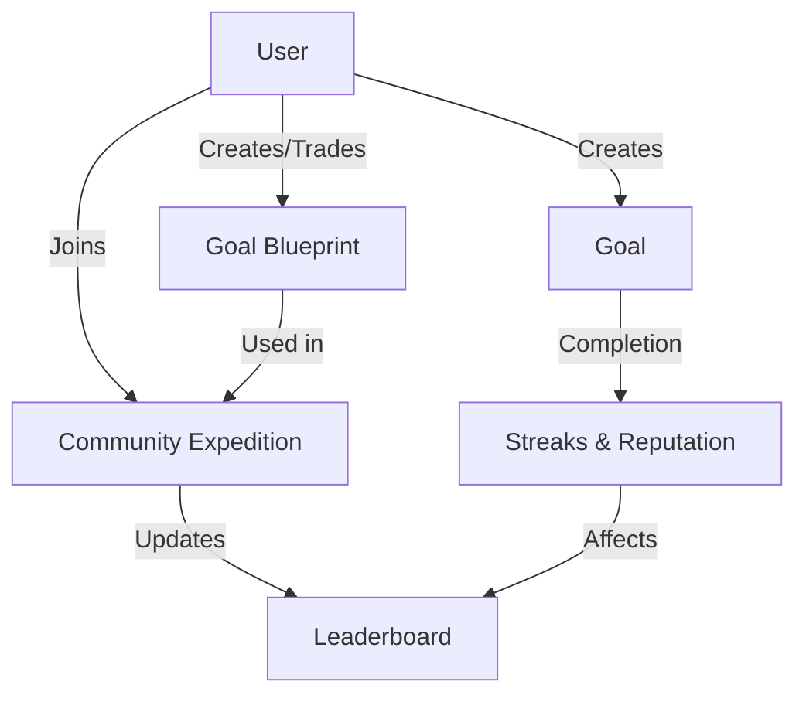

# Scheduled Yield Map 🗺️🚀

## Overview

Scheduled Yield Map is a decentralized productivity and goal-tracking smart contract built on the Stacks blockchain. By leveraging blockchain technology, this project provides a transparent, gamified system for personal and community goal management.

### Key Features

- 🎯 **Personal Goal Tracking**: Create, manage, and track personal goals with customizable parameters
- 🏆 **Reputation System**: Earn and spend reputation points based on goal achievements
- 🤝 **Community Expeditions**: Join collaborative challenges and compete on leaderboards
- 🔐 **Blockchain-Verified Progress**: Immutable goal completion records

## Technical Architecture

The smart contract is designed with several core components:

- **Goals**: Customizable objectives with difficulty, frequency, and rewards
- **User Profiles**: Track individual user achievements and reputation
- **Blueprints**: Shareable and tradable goal templates
- **Expeditions**: Community-driven challenges with collective goals



## Contract Documentation

### Goal Management

#### Creating Goals

```clarity
(create-goal 
  title: string-ascii
  description: string-utf8
  cadence: uint
  custom-interval: optional uint
  complexity: uint
  rewards: uint
  blueprint-id: optional uint) -> (response uint uint)
```

#### Achieving Goals

```clarity
(achieve-goal goal-id: uint) -> (response bool uint)
```

### Community Features

#### Creating Blueprints

```clarity
(create-goal-blueprint
  title: string-ascii
  description: string-utf8
  cadence: uint
  custom-interval: optional uint
  complexity: uint
  recommended-rewards: uint
  tradable: bool
  price: uint) -> (response uint uint)
```

#### Community Expeditions

```clarity
(create-expedition
  title: string-ascii
  description: string-utf8
  blueprint-id: uint
  start-date: uint
  end-date: uint) -> (response uint uint)
```

## Getting Started

### Prerequisites

- Clarinet
- Stacks Wallet
- Basic understanding of Clarity smart contracts

### Installation

```bash
git clone https://github.com/yourusername/scheduled-yield-map.git
cd scheduled-yield-map
clarinet console
```

## Usage Examples

### Creating a Goal

```clarity
(create-goal 
  "Daily Coding Practice" 
  "Practice coding for 1 hour daily" 
  CADENCE-DAILY 
  none 
  COMPLEXITY-INTERMEDIATE 
  50
)
```

### Joining a Community Expedition

```clarity
(join-expedition 1)  ;; Join an existing expedition by ID
```

## Security Considerations

### Limitations

- Goal achievement verification relies on self-reporting
- Expeditions have participant limits
- Blueprint trades require sufficient reputation

### Best Practices

- Always verify transaction success
- Monitor streak calculations for accuracy
- Consider gas costs when interacting with multiple functions
- Verify goal ownership before modifications
- Keep private keys secure

## Contributing

Contributions are welcome! Please read our contributing guidelines and code of conduct.

## License

MIT License

## Disclaimer

This is an experimental project. Use at your own risk.